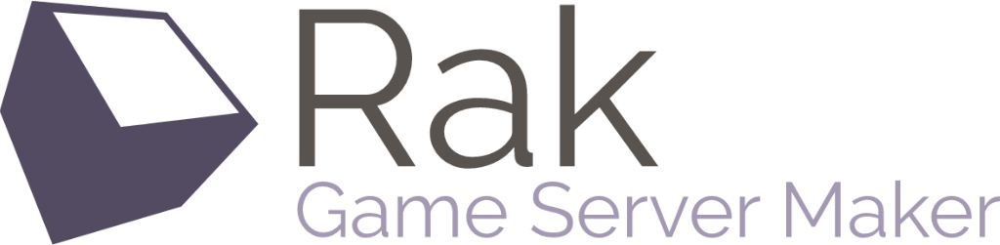

# 

[](http://hexdocs.pm/rak)
[](https://github.com/rak/rak)
[](https://travis-ci.org/rak/rak)
[](https://coveralls.io/github/rak/rak)
[](https://discord.gg/jAuGsV)

Rak is an Elixir-based framework to help you build, run and maintain custom-built, fault-tolerant game server clusters.

## Documentation

  - [User & API Guide](http://hexdocs.pm/rak)
  - [Contributor guide](./Contributing.md)
  - [Development blog](https://medium.com/rak-gamemaker)
  - [Twitter](https://twitter.com/rak-gamemaker)

## Installation

```shell
mix archive.install https://github.com/rak/rak/raw/master/rak_new.ez
```

Once you have the command-line installed, you can now create a project:

```shell
mix rak.new my-game
```

## Acknowledgements

Logo created on [LogoMakr.com](http://logomakr.com) 

  - [Logo source](https://logomakr.com/9mwNuh)
  - [Color palette](https://coolors.co/58534f-bcb8b1-534b62-a499b3-d0bcd5)

## License

MIT. [See License](./License.md)
